# AD Homelab Project

## Part 1 — Network Diagram

### Objective
Create a logical AD homelab diagram to understand network structure and telemetry flow.

### Skills Learned
* Network diagramming
* AD lab architecture
* Telemetry flow mapping

### Tools
* draw.io

### Steps

#### Ref 1: Network Diagram
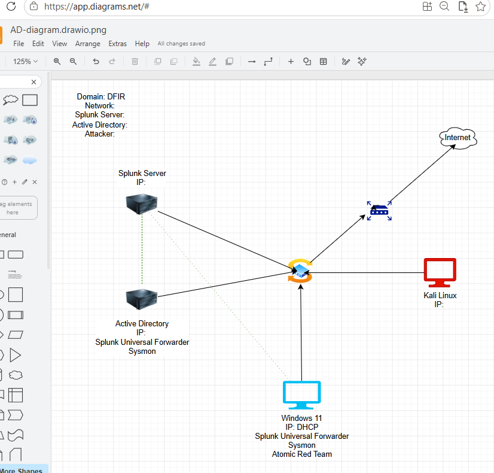

## Lab Architecture Summary
Active Directory server and Windows 11 machine both generate telemetry via Sysmon and forward logs to Splunk using Splunk Universal Forwarder for centralized monitoring. Kali Linux serves as the attacker system connected to the same network for future attack simulation.

---

# Part 2 — Virtual Machine Deployment

## Objective
Deploy and configure the virtual machines required for the AD homelab environment.

## Skills Learned
* Virtual machine deployment
* VM resource allocation
* ISO verification using SHA256 checksum
* Basic Active Directory infrastructure understanding

## Tools
* Oracle VirtualBox

## Steps

### Ref 1: Virtual Machine Installation
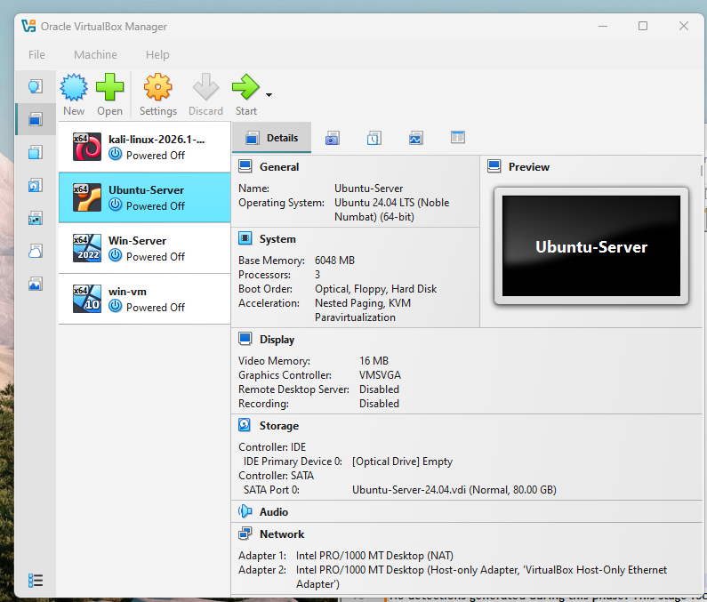

VirtualBox manager showing all four VMs (Win10, Kali, Win Server 2022, Ubuntu Server) with Ubuntu Server 24.04 LTS configuration details displayed, used as the primary infrastructure node.

## Summary
ISO files were verified using SHA256 to ensure integrity before installation. VM resources were assigned based on role, with Splunk allocated higher capacity for log ingestion and search performance. Final setup provides a stable AD lab environment for telemetry and attack simulation.

---

# Part 3 — Splunk Data Ingestion & Verification

## Objective
Install & configure Sysmon and Splunk on Windows 10 and Windows Server so they can start collecting telemetry and send logs to Splunk server for monitoring and analysis.

## Skills Learned
* Windows event logging and Sysmon telemetry generation
* Splunk Universal Forwarder deployment and configuration
* Log ingestion and indexing in Splunk (`inputs.conf`, custom index setup)
* NAT networking and static IP configuration in a lab environment
* Multi-host SIEM data pipeline validation (Win10 + Windows Server → Forwarder → Splunk Indexer)

## Tools
* Splunk Enterprise (SIEM) / Universal Forwarder
* Sysmon
* Windows 10/Server VMs
* Ubuntu Server
* VirtualBox / NAT Network
* PowerShell / Windows Event Viewer

## Steps

### Ref 1: Splunk Log Ingestion Confirmation
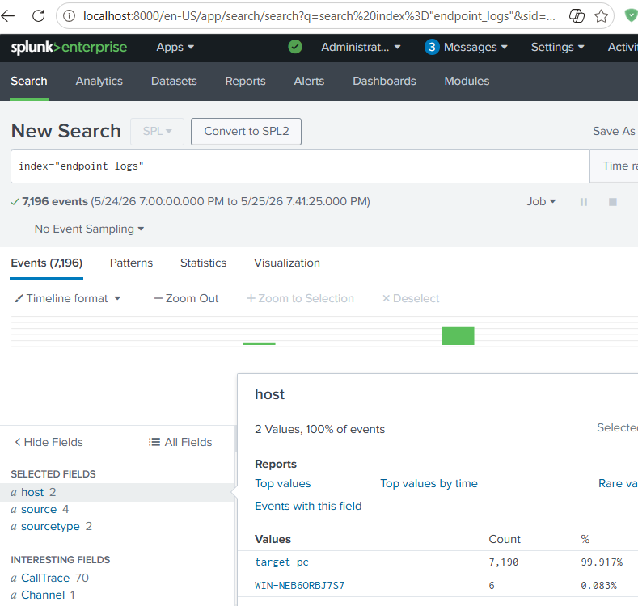

Splunk search results showing 7,196 events from 2 hosts and values are target-pc and WIN-NEB6ORBJ7S7, confirming successful centralized log ingestion from multiple endpoints.

### Ref 2: Sysmon Log Source Search
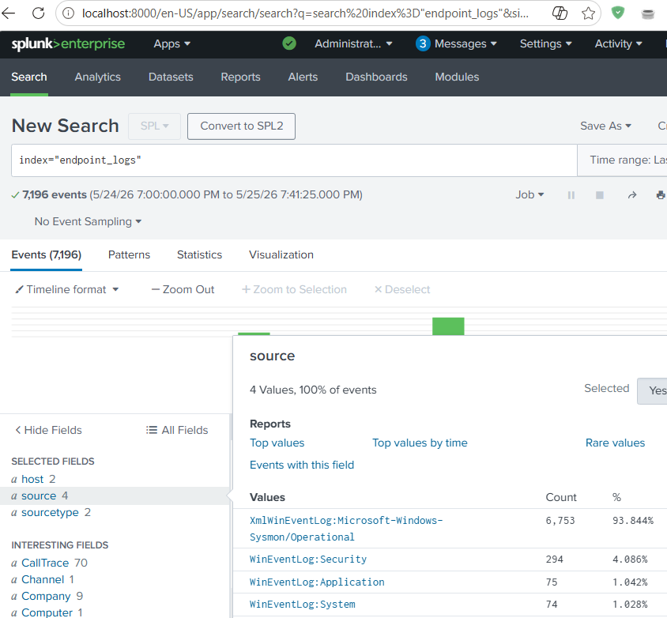

Splunk search showing source(4) and source type(2). My inputs.config file specifically mentioned Security, Application, System and Sysmon data under Values.

## Summary
Splunk confirmed successful ingestion of telemetry from 2 hosts, with key log sources (Sysmon, Security, Application, System) from inputs.config. No anomalies or security incidents identified at this stage; logs represent baseline system activity.

---

# Part 4 — Active Directory Configuration & Domain Join

## Objective
Install and configure Active Directory Domain Services (AD DS) on the Windows Server environment, promote the server to a Domain Controller (DC), create enterprise organizational structures, and successfully join a target Windows 10 endpoint to the newly established domain.

## Skills Learned
* Active Directory Domain Services (AD DS) Administration
* Domain Controller (DC) Deployment and Promotion
* DNS and Static IP Configuration in Enterprise Networks
* Organizational Unit (OU) and Identity Management
* Windows Domain Join and Authentication Validation

## Tools
* Windows Server
* Windows 10 VM
* Active Directory Domain Services (AD DS)
* Active Directory Users and Computers (ADUC)

## Steps

### Ref 1: Active Directory Domain Services Installation
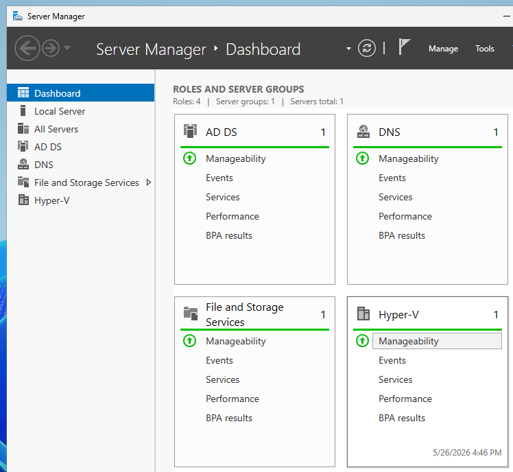

Server Manager dashboard displaying Active Directory Domain Services (AD DS) and DNS roles fully installed and operational on the server, showing healthy active status indicators.

### Ref 2: Organizational Unit & Identity Architecture
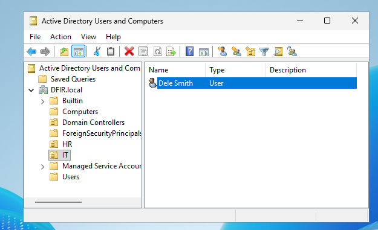

Active Directory Users and Computers (ADUC) console management view showing the `DFIR.local` domain tree with a dedicated corporate structure, displaying the HR and IT Organizational Units (OUs) alongside the newly provisioned employee account for Dele Smith.

### Ref 3: Endpoint Domain Asset Discovery
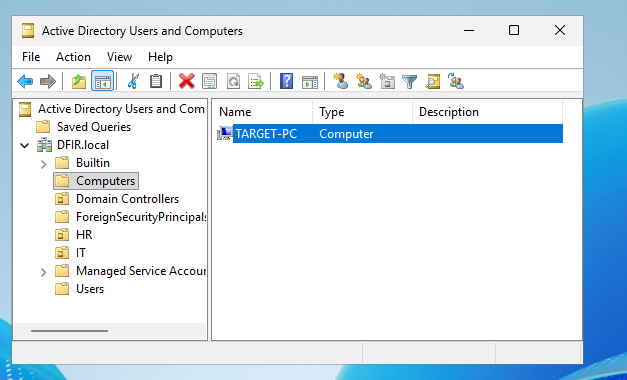

Active Directory Users and Computers (ADUC) console tracking the standard Computers container, validating that the endpoint `TARGET-PC` successfully requested entry and was joined to the `DFIR.local` enterprise network.

### Ref 4: Enterprise Authentication Verification
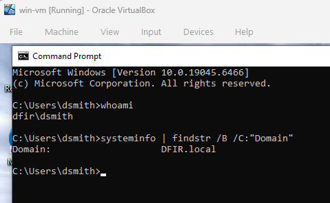

Command-line execution outputs checking active environment details on the workstation, confirming authenticated workspace session context as `dfir\dsmith` and system membership within the `DFIR.local` domain.

## Summary
Active Directory was successfully configured on the server, promoted to a Domain Controller for `DFIR.local`, and the Windows 10 machine successfully joined and authenticated to the domain using the Dele Smith account, confirming full domain functionality.

---

# Part 5 — Cyber Attack Simulation & Detection

## Objective
Use Kali Linux to perform a brute-force attack against Active Directory users and run MITRE ATT&CK techniques with Atomic Red Team, using Splunk to query the activity and identify detection gaps.

## Skills Learned
* Active Directory attack simulation and detection analysis
* RDP brute-force attack execution using Hydra
* Splunk log analysis and telemetry investigation
* Windows Security Event and Sysmon log monitoring
* MITRE ATT&CK technique mapping and validation
* Atomic Red Team installation and attack simulation
* Detection gap identification and visibility analysis
* PowerShell-based attack execution and monitoring

## Tools
* Kali Linux
* Hydra
* Splunk Enterprise (SIEM)
* Windows Server (Active Directory Domain Controller)
* Windows 10 Client VM
* Atomic Red Team
* Sysmon

## Steps

### Ref 1: Hydra RDP Brute-Force Execution
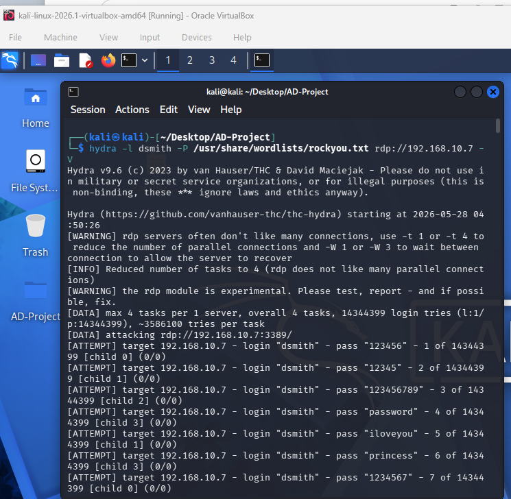

Hydra RDP brute-force attack executed against the target Windows machine (user: dsmith) using a reduced RockYou wordlist (first 20 entries), generating multiple login attempts over the RDP service.

### Ref 2: Splunk RDP Brute-Force Detection (EventCode 4625)
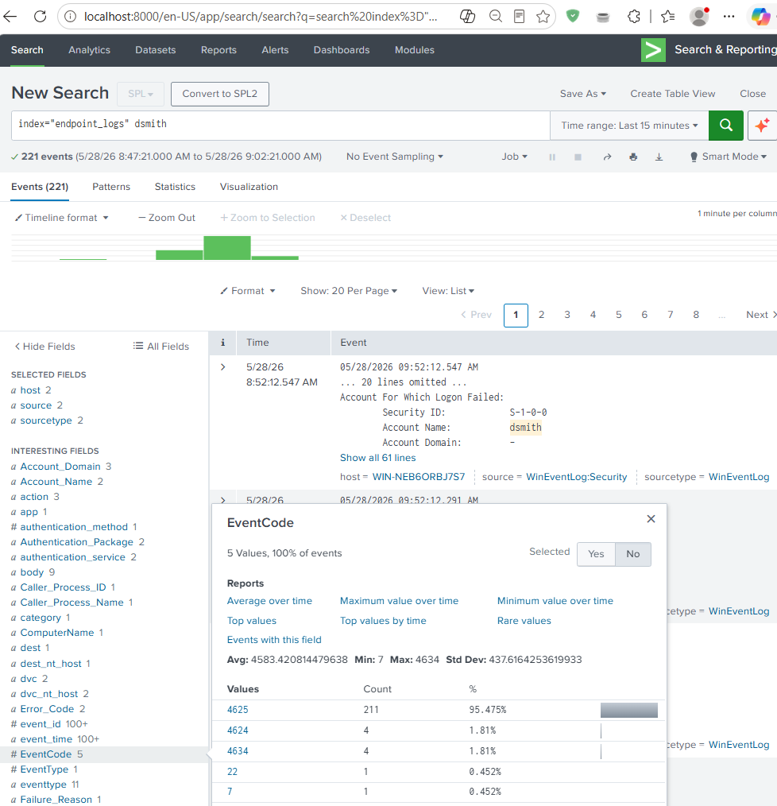

Splunk query results showing RDP brute-force activity against WIN-NEB6ORBJ7S7, including failed logon events (EventCode 4625) and authentication telemetry correlated from Windows Security logs.

### Ref 3: Splunk Successful Compromise Verification (EventCode 4624)
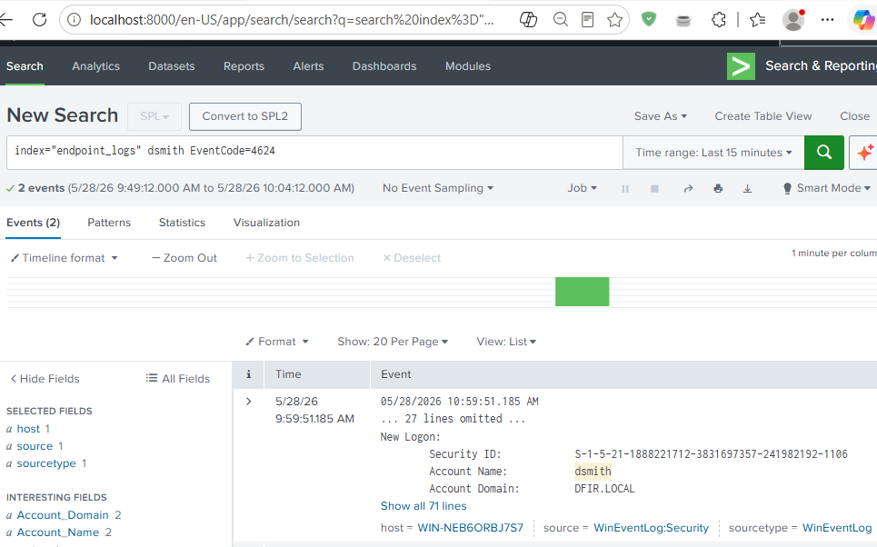

Splunk event showing successful RDP logon (EventCode 4624) for user dsmith on WIN-NEB6ORBJ7S7, including authentication and source log details confirming the brute-force succeeded.

### Ref 4: Atomic Red Team Persistence Execution (T1136.001)
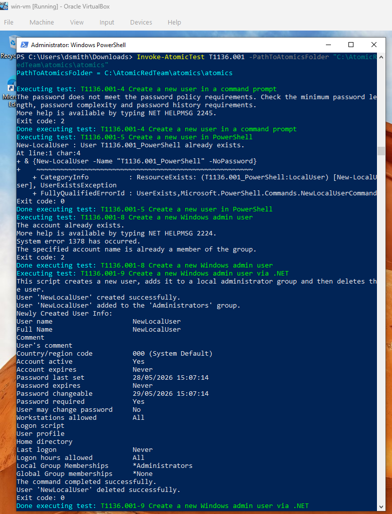

Atomic Red Team execution output for MITRE ATT&CK technique ID T1136.001, showing local user creation, privilege escalation to Administrators, and cleanup on the Windows 10 target VM.

### Ref 5: Splunk Malicious Account Creation Detection
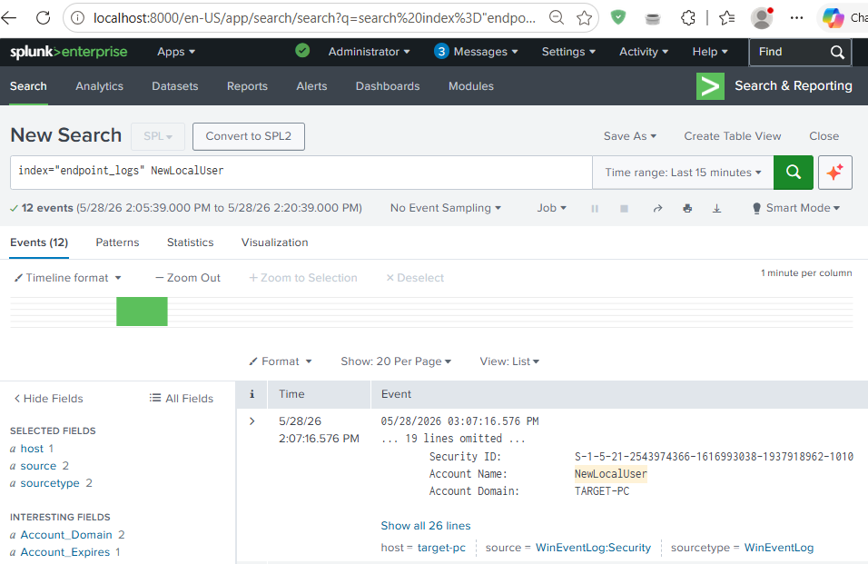

Splunk detection showing Atomic Red Team T1136.001 activity, including creation of local user account “NewLocalUser” on the target Windows machine.

## Summary
* Splunk detected RDP brute-force activity (EventCode 4625) with 211 failed login attempts against the “dsmith” account, followed by successful authentication events (4624).
* All events occurred within the same time window, indicating clear brute-force behavior.
* Expanded logs showed source workstation name and IP address involved in the attempts.
* Atomic Red Team T1136.001 execution showed creation of local user “NewLocalUser” on the target system, mapped to MITRE ATT&CK persistence technique.
* Both brute-force and ART activity generated true positive detections, confirming SIEM visibility across initial access and persistence stages.
* This enables future alert creation for similar brute-force and MITRE ATT&CK-based behaviors.

